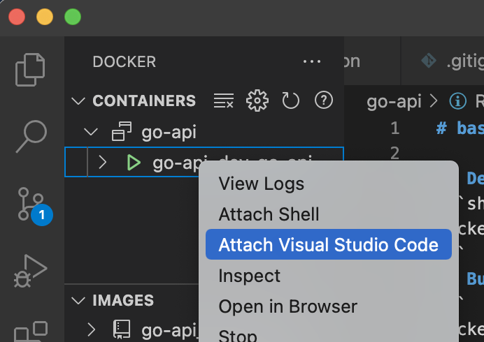
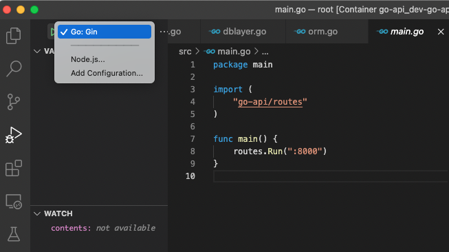

# CRUD api on Go

<a href = "https://velog.io/@curiosity806/Go-Gin-Web-Framework-CRUD-%EB%A7%9B%EB%B3%B4%EA%B8%B0">[Go] Gin Web Framework CRUD 맛보기</a>

## Development

### 1. docker-compose up
```shell
$ cd dev
$ docker-compose up
```
### 2. Attatch vscode
<div align="center">
    
</div>

### 3. Run main.go on debug

<div align="center">
    </img>
</div>

## Build deployment image

```
$ docker build -t go-api:latest .

$ docker run -p 8000:8000 --env-file .env go-api:latest
```

## Reference
  - Hands-On Full-Stack Development with Go
  - https://github.com/gin-gonic/gin