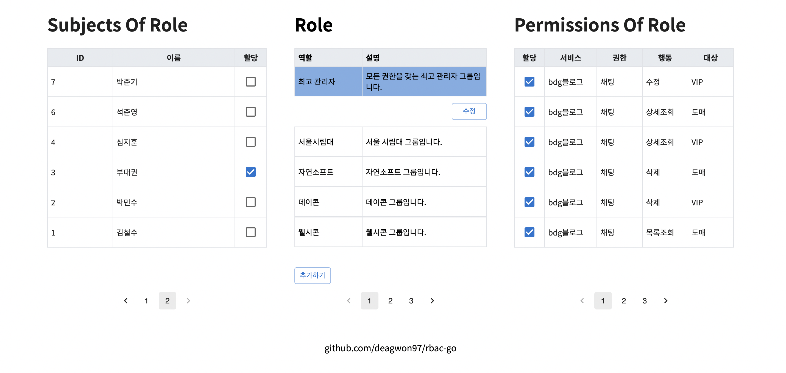

# RBAC api with Go

Go Gin 과 React를 사용하여 만든 RBAC 시스템입니다. 일반적인 RBAC 시스템과 다르게 Permission이 Action과 Object로 분리되어 있습니다. Permission 이름, Action, Object는 개발타임에 결정이 되며, Application은 시작되는 순간에 Permission에 대한 정보를 rbac-go로 전달해야합니다.
## Admin Page
<div align="center">
    
</div>
React를 활용하여 Admin page를 구성하였습니다. 위 화면은 다음 기능을 수행합니다.  

- Role의 생성, 수정, 삭제
- Permission - Role 할당, 취소
- Subject - Role 할당, 취소

단, Permission 생성 수정 삭제는 수행하지 않습니다. 해당 작업은 Service application이 담당합니다. Service application은 서버스를 시작하는 순간, rbac-go에 가장 최신 상태의 permission table을 전송하고, rbac-go는 이 정보를 통해서 service 별 permission table을 최신화 합니다. 

## Check Permission

### Request
행동, 권한이름, 서비스이름, 사용자 아이디를 입력받아
해당 조건의 Objects(행동의 대상들)을 반환합니다.
(행동의 대상이 존재하지않아도, 행동 자체 권한이 있을 수 있습니다. 권한의 존재 여부는 is_allowed를 통해서 확인합니다.)
```sh
curl -X 'POST' \
  '{host-domain}/rbac/permission/objects' \
  -H 'accept: application/json' \
  -H 'Content-Type: application/json' \
  -d '{
  "action": "삭제",
  "name": "게시판",
  "service_name": "bdg블로그",
  "subject_id": 3
}'
```

### Response
```
{
  "objects": [
    "공지",
    "비밀",
    "자유"
  ],
  "is_allowed": true
}
```

## Development
본 프로젝트는 vscode의 devcontainer위에서 작업하였습니다. 개발에 필요한 plugin 및 go dependency는 devcontainer.json을 통해서 관리합니다.
### 1. Run docker compose and Attach the container
<div align="center">
    
</div>

### 2. Run main.go on debugger

<div align="center">
    </img>
</div>

### 3. Create docs
api는 swagger를 통해서 문서화 합니다. create-docs.sh는 swagger static 문서를 생성하며, postman 에서 import할 수 있는 openapi2 형식의 openapi.json 문서를 생성합니다.
```
$ cd /root/src/
$ sh create-docs.sh
```
<div align="center">
    </img>
</div>


## Reference
  - https://unknownpgr.com/posts/rbac/
    - 권준호님의 rbac에 관한 포스트를 읽고 본 프로젝트를 시작하였습니다.
  - Hands-On Full-Stack Development with Go
    - rbac-go project의 model-dblayer-rest 구조는 Hands-On Full-Stack Development with Go를 참고하여 구성하였습니다.
  - https://github.com/gin-gonic/gin
  - https://github.com/golang-jwt/jwt
