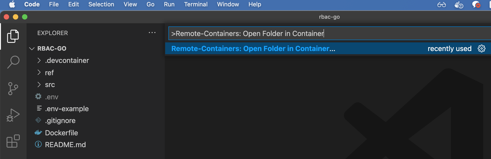
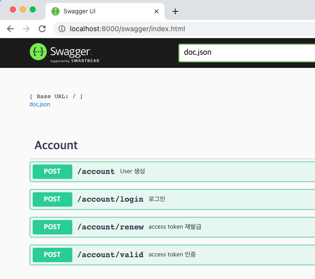

# RBAC api with Go

## Development

### 1. Run docker compose and Attach the container
<div align="center">
    
</div>

### 2. Run main.go on debugger

<div align="center">
    </img>
</div>

### 3. Create docs

```
$ cd /root/src/
$ swag init
```

### 4. Open Browser
<div align="center">
    </img>
</div>

## Build deployment image

```
$ docker build -t rbac-go:latest .

$ docker run -p 8000:8000 --env-file .env rbac-go:latest
```

## Reference
  - Hands-On Full-Stack Development with Go
  - https://github.com/gin-gonic/gin
  - https://github.com/golang-jwt/jwt